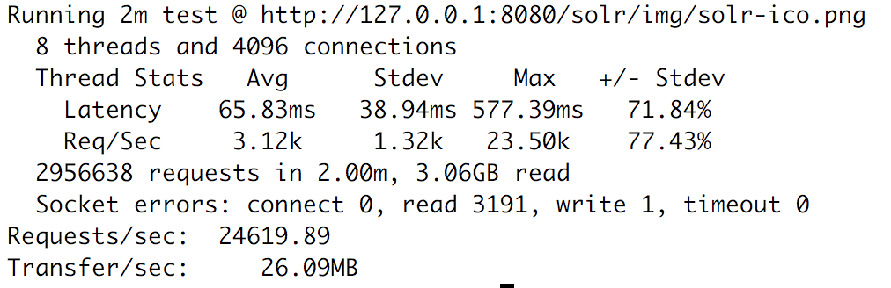

# A Layer 7 (HTTP) Router

Ok, so it's not a Layer 7 (HTTP) router yet.

So then what is it?

In it's current state it's a full duplex TCP (HTTP) proxy based on NIO/XNIO that can parse the first X number of packets (up to 32KB of data) from a TCP/HTTP connection. 
32K worth of HTTP headers should be enough to route the request to the appropriate backend server.

<pre>

            Client ------------> Layer7Router ------------> |
                                                            | Backend Servers
            Client <------------ Layer7Router <------------ | 
</pre>

How does it work?

- Allocate X number of direct ByteBuffers.
    - Buffers are managed by ByteBufferSlicePool, which allocates a single region of memory from which buffer slices are allocated.
      In the current implementation, this presents an upper limit on the number of concurrent TCP sessions that can be handled, since buffers are held
      per session. The max number of sessions is determined by dividing `maxRegionSize/bufferSize/2`. The default is 32K buffers of 32KB each for 16K sessions.
- Create a StreamConnectionServer with XNIO
    - Handles incoming connections.
- Register a ChannelListener that will be notified of accepted connections
	- Instantiate and Register one Read and one Write ready handler per connection.

- Read Handler (1)
	- Allocate a ByteBuffer (slice) from the buffer pool
        - This buffer will be used to read from the client and write to the backend for the duration of the session
	- Read the first X number of packets into the buffer
		- TODO implement header parsing/analysis/routing decision
	- Suspend Read notifications on Read handler (1)
	- Open a connection to backend server
		- Instantiate and register Read and Write handlers (2)
			- The Read Handler (2) calls resume on the Read Handler (1) when the backend connection is ready for writes
			- The Write Handler (2) calls resume on the Write Handler (1) when the backend connection is ready for reads
	- When backend socket is ready, the Read Handler is called again
	- Write the headers to the backend (first call)
	- Write the body (or rest of headers) (subsequent calls)

- Write Handler (1)
	- Allocate a ByteBuffer (slice) from the buffer pool
        - This buffer will be used to read from the backend and write to the client
    - When the Read Handler (2) is ready it will resume writes on Write Handler (1)
    - Write from backend to client using the buffer
    - Write Handler call suspend writes on itself
    
TODO
- Figure out missing signaling between read/write listener?

# Performance/Benchmark

- The benchmark was run with [wrk](https://github.com/wg/wrk "wrk")
    - wrk was configured with 4096 connections and 8 threads
    - the payload was a 1KB image from the backend
    - wrk was run on the same machine as Layer7Router (less than optimal)
- The Layer7Router is running on a Macbook pro with an Intel I7 Dual Core CPU with 2 worker threads. 
- The backend is running on an Intel Quad Core I7. 
- The backend is running a Jetty web app.

          